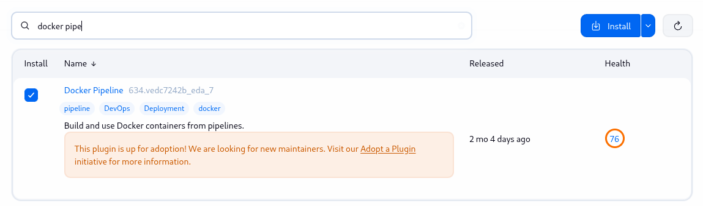
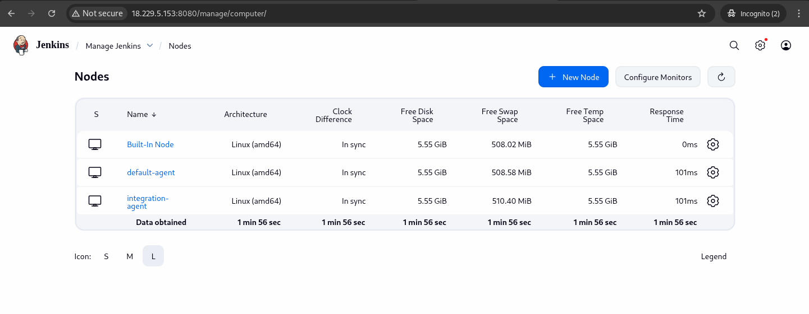
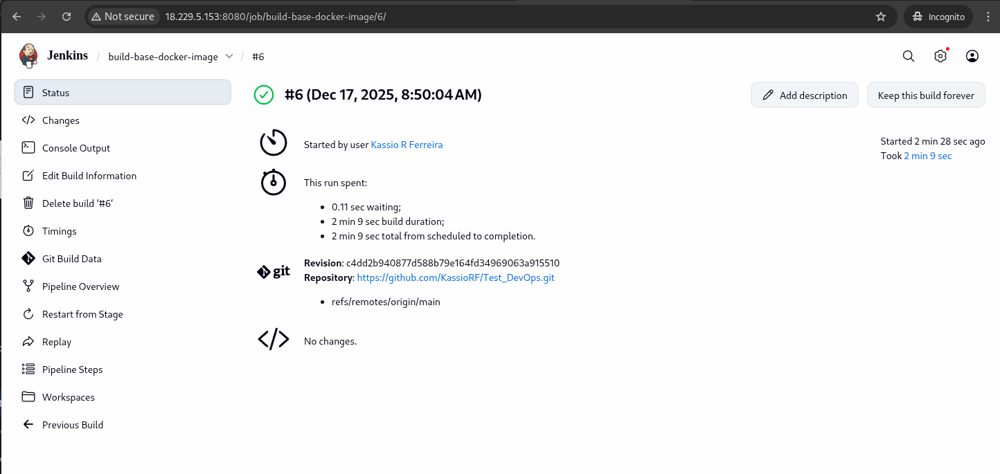
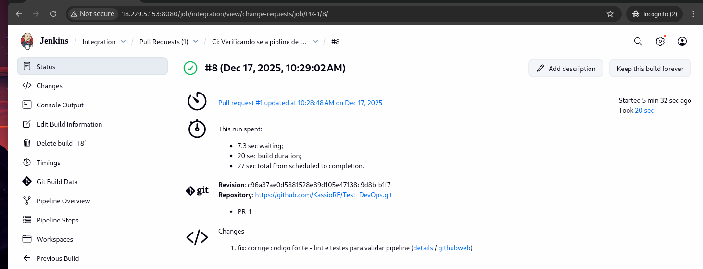
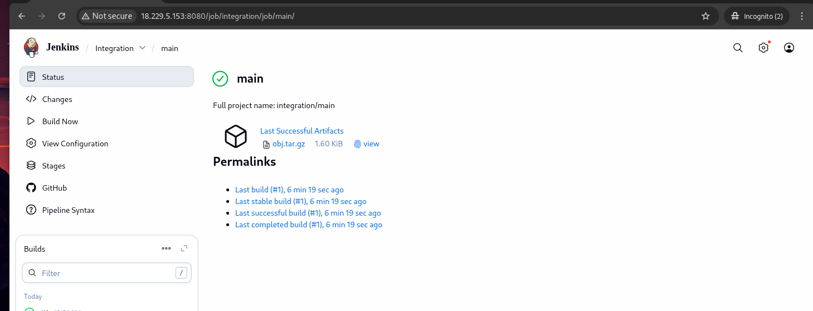
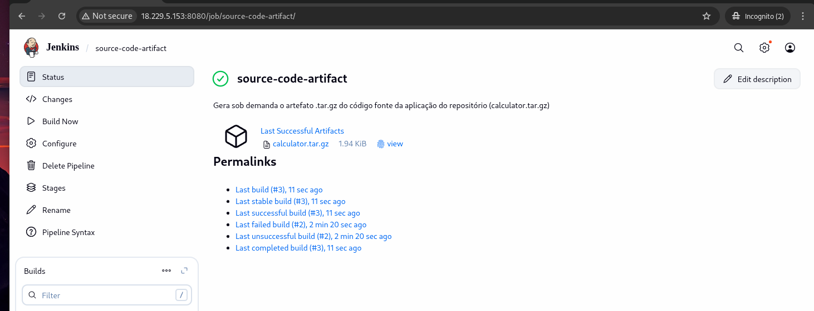

# Prova Técnica Devops

- Kassio Rodrigues Ferreira

## Estrutura do repositório:

```
.
│   # Código fonte disponibilizado
├── calculator       
│   ├── Makefile
│   ├── README.md    
│   ├── src
│   └── tests
|
|   # Pipelines e imagem docker para o ambiente Jenkins
├── infra 
│   ├── Dockerfile.base-image
│   ├── Jenkinsfile.build-image        
│   ├── Jenkinsfile.ci-validate
│   └── Jenkinsfile.export-source-code
└── README.md
```

## Resumo Geral:

O repositório foi integrado em um ambiente Jenkins + Docker onde foram implementados os seguintes recursos:

- Geração de artefatos sob demanda (código fonte de calculator)
- Ambiente integrado Jenkins x Github Webhooks
- Pipeline de integração contínua.
  - Estágios pré-merge (PRs): validação de código e execução de testes unitários
  - Estágio pós-merge (Push): Geração dos executáveis da aplicação via artefatos

## Etapas Realizadas:

A seguir documento de forma mais detalhada as etapas realizadas


### Preparação do Host

Houveram 3 configurações princiapais no Host disponibilizado:

- Instalção do Docker
- Instalação do servidor Jenkins 
- Adição de 1GB de memória SWAP para assegurar estabilidade de disponibilidade dos recursos implantados no servidor.


As instalações foram padrão, conforme as documentações oficiais: [Docker]((https://docs.docker.com/engine/install/ubuntu/)) - [Jenkins](https://www.jenkins.io/doc/book/installing/linux/#debianubuntu)


E um pequeno setup *post-install* no Jenkins, para definir o diretório padrão de arquivos temporários, e limitação do uso de RAM do serviço (Jenkins-Controller). Segue onde e como foi aplicada esta configuração:

####  Jenkins *post-install*

Para o post-install, apenas foram definidas algumas configurações base, como diretório temporário (cache), e uma limitação de memória para o serviço master do Jenkins


```bash
# sudo systemctl edit jenkins
[Service]
Environment="JAVA_OPTS=-Xmx256m -Djava.awt.headless=true -Djava.net.preferIPv4Stack=true -Djava.io.tmpdir=/var/cache/jenkins/tmp/ -Dorg.apache.commons.jelly.tags.fmt.timeZone=America/New_York -Duser.timezone=America/New_York"
Environment="JENKINS_OPTS=--pluginroot=/var/cache/jenkins/plugins"

# Para aplicar:
# sudo systemctl stop jenkins
# sudo systemctl daemon-reload
# sudo systemctl start jenkins
```

#### Plugins utilizados

O unico plugin adicional utilizado, fora os recomendados no primeiro acesso da UI, foi o ``docker pipelines``.




### Nós de agentes de execução

Foram criados dois nós de agentes de execução com a intenção incial de que um fosse responsável por tarefas manuais ou agendadas, e o outro para tarefas integradas com eventos no repositório (*Pull Requests* e *Pushs*)

Os agentes foram registrados via UI: *Manage Jenkins* -> *Nodes* -> *New Node*, e instanciados de forma concreta via docker container, sendo um container para cada agente. Foi utilizando o seguinte comando:

```bash
sudo docker run -d \
--name default-agent \
--restart unless-stopped \
-v /var/run/docker.sock:/var/run/docker.sock \
jenkins-agent-with-docker \
-url http://<IP.DA.VM>:8080/ \
-secret <secret-do-agente> \
-name default-agent \
-webSocket \
-workDir /home/jenkins
```




### Integração Jenkins Github + Webhooks


A credencial Github registrar no Jenkins foi o Token de acesso (com escopo reduzido, a nível de repositório). Onde foram atribuídas permissoes para alguns escopos do repositório além do acesso ao código fonte, como events de push PR e status de commits.

> Github -> Settings -> Developer Settings -> Personal access tokens -> Fine-grained tokens.


A segunda integração foi a inclusão do github-webhook (disponível no Jenkins via plugin do github) que permitiu a comunicação entre as duas plataformas em relação eventos tanto no repositório do lado do Jenkins quanto ao resultado das piplines no lado do Github. 

O processo foi feito no Github registrando a Url pública do Jenkins (Ip + Porta) ao settings do repositório, como segue:

> Github -> repositório -> settings -> webhooks -> Add webhook


### Tarefa com gatilho manual: fazer o build da imagem base nos agentes de execução


> [``infra/Jenkinsfile.build-image``](./infra/Jenkinsfile.build-image)

A primeira pipeline implementada tem como finalidade criar uma imagem Docker com o ambiente isolado, adequado e reutilizável para rodar o códgo fonte da aplicação disponibilizada.


Um resultado da execução é mostrado na imagem abaixo para exemplificar:




A imagem é definida a partir do Dockefile [``./infra``](./infra/Dockerfile.base-image) que basicamente garante as depências C++ assim como cmake e clang para o *code check*.

Além disso a imagem também foi utilizada para verificar o estado do código original em relação a formatação, e consistência dos testes unitários.

Para referência, logo abaixo mostro como executar o código tendo a imagem como ambiente base:

```bash
# 1 - Fazer construir a imagem
# na raiz do repositório
docker build -f infra/Dockerfile.base-image -t cpp-calculator .

# 2 - Executar o container, mapeando um volume apontando para o diretório raiz do código fonte
docker run --rm -it -v $(pwd)/calculator:/workspace cpp-calculator

# Daqui em diante entramos em um ambiente bash iterativo
# E assim é possível rodar os comandos make, etc..
```

A partir dessa execução, já foi possível identificar os problemas relacionados a qualidade do código, e os pontos onde a pipeline deveria rejeitálos. Os problemas foram mantidos no código fonte até que a pipeline de validação ficasse pronta. Onde foi possível validar o comportamento esperado da pipeline para estes casos onde o código deveria ser rejeitado.


### Pipeline de Integração: Checagem de código, testes e artefato final.

> [``infra/Jenkinsfile.ci-validate``](./infra/Jenkinsfile.ci-validate)


A pipeline de integração conta com ações distintas para eventos de *open Pull-Request* e *Push-event*. A captura desses eventos pelo Jenkins é possível via integração com os Webhooks (citado anteriormente).

Em resumo, quando o PR é aberto, a pipeline de validação é invocada. E quando o push é feito, a pipeline de deploy entra em ação.

> É importante citar que essa abordagem faz mais sentido quando mantemos branchs protegidas, como ambientes ``develop``, ``staging``, e ``production``, por exemplo.

Mas pra exemplificar resolvi adotar o modelo neste teste, mesmo tendo apenas uma branch principal (``main``).


Como resultado, para PRs abertos temos as ações de validação: Verificação de código, e testes unitários

> Lembrando que neste ponto tive que ajustar o lint do código fonte, a formatação e também o teste problemático com a divisão por 0 no denominador permitida.




Depois que o Merge é feito, então a tarefa de gerar o artefato do código é disparada:





## Geração do código fonte sob demanda 

> [``infra/Jenkinsfile.export-source-code``](./infra/Jenkinsfile.export-source-code)


Pra fechar adicionei uma pipeline para gerar o código fonte da aplicação (calculator) sob demanda. Sendo este apenas disparado de forma manual.




